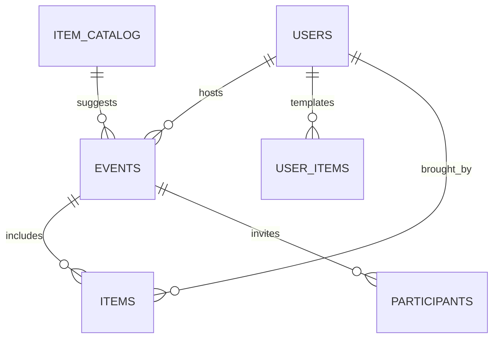
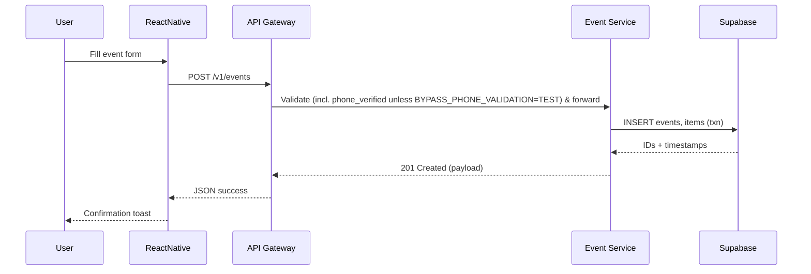
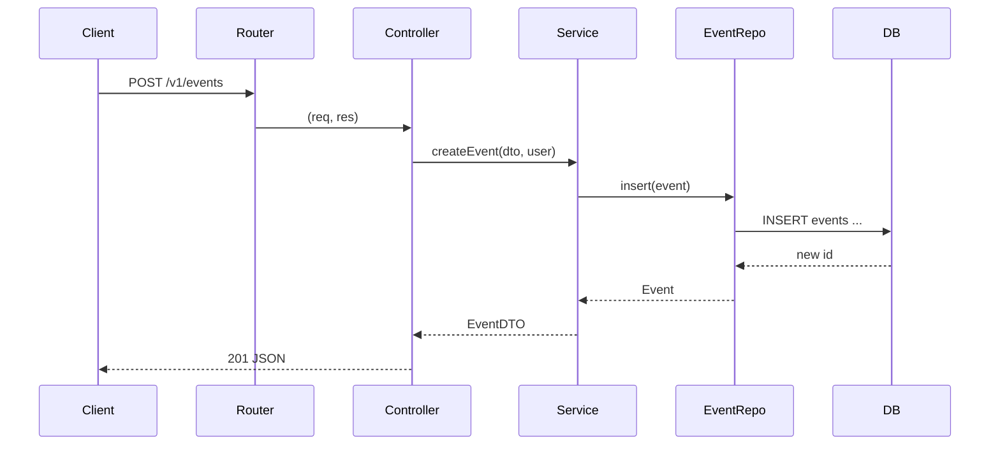

# Potluck Application – System Architecture

> **Status**: Updated · v0.3 · 21 Sep 2025

---

## 1. Overview

The Potluck application is a cross‑platform solution that helps groups coordinate shared meals. It is composed of a **React Native mobile client**, a **Node.js/Express API layer**, a **Supabase backend (PostgreSQL, Auth, Storage, Edge Functions)**, and optional **AI agents** that provide smart suggestions (e.g., balanced menus, reminder timing).

The system is organised into **bounded contexts** that map directly to the functional chats you created:

| Bounded Context  | Responsibility                                       |
| ---------------- | ---------------------------------------------------- |
| **Event**        | Create/manage potluck events, scheduling, visibility |
| **Items**        | CRUD for event items, user templates, global catalog |
| **Participants** | Invitations, RSVPs, role management                  |
| **User**         | Profile, preferences, auth linkage, phone verification |
| **Payment**      | Contribution tracking, split payments (future)       |
| **Location**     | Venue search, geofencing, map links                  |

Shared concerns—authentication, logging, error handling, configuration, and common DTOs—reside in a **shared `@potluck/common` library** consumed across services.

---

## 2. Technology Stack

* **Frontend** · React Native (Expo SDK <latest>)
* **Backend** · Node.js 20 · Express 5 · TypeScript
* **Database** · Supabase (Postgres 15) with Row‑Level Security (RLS)
* **Auth** · Supabase Auth (email‑link + OAuth)
* **AI Agents** · OpenAI o3 via Edge Functions
* **CI/CD** · GitHub Actions → Render for API · Expo EAS for mobile
* **Observability** · Winston + pino‑http · CrowdStrike Logs (prod) · Grafana Cloud

---

## 3. Logical Architecture

```mermaid
graph LR
  RN[React Native App] -- REST / HTTPS --> AGW(API Gateway)
  subgraph Node API Cluster
    AGW --> EV[Event Service]
    AGW --> IT[Items Service]
    AGW --> IL[Items Library]
    AGW --> PR[Participants Service]
    AGW --> US[User Service]
  end
  EV & IT & PR & US --> DB[(Supabase Postgres)]
  EV -- Edge RPC --> AI[AI Agent Layer]
  push((Push / Email)) <-- EV
```

### Key Notes

1. **API Gateway** exposes a unified `/v1/*` surface and handles auth middleware, rate limiting, and correlation IDs.
2. Each service is **modularised** inside the monorepo (`apps/server/src/modules/<context>`). In future they can be split into discrete microservices without breaking contracts.
3. Supabase Edge Functions handle **webhooks** for email verification and AI tasks that need lower latency. Payment processor callbacks are handled in‑process at `/api/v1/billing/webhook/:provider` with raw body parsing; `stripe` is normalized to `lemonsqueezy` in dev. Phone verification OTPs are sent via pluggable SMS provider (Twilio or console fallback).

---

## 4. Component Responsibilities

### 4.1 React Native App

* Offline‑first cache via React Query + SQLite
* Deep links for invites (`potluck://event/{id}`)
* Automatic OTA updates via Expo Updates

### 4.2 Node API

* Typed routes using `zod` schemas for validation
* `winston` loggers with **daily rotate file** transport (`logs/YYYY‑MM‑DD‑<module>.log`)
* Global error handler returns RFC 7807 Problem+JSON

### 4.3 Supabase

* **Postgres** schema under `public`. RLS enforces tenant isolation by `user_id`.
* Items library tables: `item_catalog` (global), `user_items` (per user).
* User profile phone verification fields: `user_profiles.phone_e164`, `user_profiles.phone_verified`.
* OTP challenges stored in `phone_verifications` with hashed codes and TTL.
* **Storage** bucket `event‑images/*` with signed URLs.

### 4.4 AI Agent Layer

* Composed as OpenAI Function‑calling chain inside Edge Function `suggestMenu.ts`.
* Caches responses in `ai_cache` table (TTL = 7 days) to reduce cost.

---

## 5. Domain Model (simplified)



---

## 5.1 Recent Data Model Additions (2025‑09)

- `item_catalog(id, name, category, unit, default_per_guest_qty, dietary_tags[], description, is_active, …)`
- `user_items(id, user_id, name, category, unit, default_per_guest_qty, dietary_tags[], notes, …)`
- `event_items` includes nullable `catalog_item_id` and `user_item_id` to link to catalog or user template.
- Join Requests: `event_join_requests` supports `waitlist_pos`, with functions `process_join_request`, `update_request_status`, `promote_from_waitlist`, `expire_join_request_holds`.
 - Phone Verification: `phone_verifications(id, user_id, phone_e164, code_hash, expires_at, attempts, created_at)` plus new columns on `user_profiles`.

---

## 6. Typical Flow – “Create Event with Items”



---

## 7. Deployment Architecture

| Tier           | Runtime             | Notes                                      |
| -------------- | ------------------- | ------------------------------------------ |
| Mobile         | Expo EAS            | iOS / Android builds; over‑the‑air updates |
| API            | **Render** (Docker) | 2 × `small` instances · autoscale to 4     |
| Edge Functions | Supabase Edge       | Vercel‑like DX; cold < 50 ms               |
| Database       | Supabase            | daily PITR · WAL enabled                   |
| Object Storage | Supabase Storage    | Images, receipts                           |

A **GitHub Actions** workflow triggers:

1. PR → ESLint + test on every push
2. `main` → build Docker + deploy API
3. Tag `mobile-v*` → EAS build → App Store/TestFlight

---

## 8. Observability & Logging

* **Structured logs** (JSON) with Winston → Loki (SMS send results logged as info; OTP codes never logged in production)
* **Correlation IDs** propagated (`X-Request-ID`)
* **Metrics** via Prometheus exporter `/metrics`
* **Tracing** (OpenTelemetry) to Grafana Tempo

---

## 9. Security & Compliance

* RLS + JWT verification inside Postgres
* Audit trail tables (`audit.event_*`) with triggers
* Secrets managed via Render Environment Groups & Supabase Secret Manager
* GDPR‑ready data export job (daily S3 sync)

---

## 10. Environment Configuration

```text
apps/
├─ mobile/           # React Native
├─ server/
│  ├─ src/
│  │   ├─ modules/
│  │   ├─ middleware/
│  │   ├─ shared/
│  │   └─ index.ts
│  └─ Dockerfile
└─ shared/
   └─ common/        # DTOs & utils
```

Use `.env` for local dev; `.env.production` is injected in CI.

---

## 11. Future Enhancements

* **GraphQL Gateway** (Apollo Router) for typed contracts
* **Payment Context** integrating Razorpay/Stripe for pooled contributions
* **Real‑time presence** using Supabase Realtime on channel `event:{id}`
* **ML‑powered dish recommendations** based on dietary preferences

# Backend – Express Folder Structure & Conventions


## 1. Why This Structure?

Our Node API is intentionally organised into small, replaceable parts so that each bounded context (Event, Items, Participants, …) can **scale independently** and **evolve toward micro‑services** if needed. The layout borrows from **DDD layering** (Routes → Controller → Service → Data → Domain) and mirrors common practice in Java/Spring and .NET to ease onboarding for polyglot engineers.

---

## 2. High‑Level Directory Map

```
apps/
└─ server/
   ├─ src/
   │  ├─ modules/
   │  │   ├─ event/
   │  │   │   ├─ event.controller.ts
   │  │   │   ├─ event.routes.ts
   │  │   │   ├─ event.service.ts
   │  │   │   ├─ event.repo.ts         # Supabase queries
   │  │   │   ├─ event.schema.ts       # zod DTOs
   │  │   │   ├─ event.types.ts
   │  │   │   └─ __tests__/event.test.ts
   │  │   ├─ items/
   │  │   └─ … (other bounded contexts)
   │  │
   │  ├─ middleware/
   │  │   ├─ auth.middleware.ts
   │  │   ├─ error.middleware.ts
   │  │   └─ request‑id.middleware.ts
   │  │
   │  ├─ shared/
   │  │   ├─ logger.ts       # Winston wrapper
   │  │   ├─ config.ts       # env + typed accessors
   │  │   ├─ http.ts         # typed Response helpers
   │  │   └─ tracing.ts      # OpenTelemetry setup
   │  │
   │  ├─ app.ts    # Express construction & DI
   │  └─ index.ts  # HTTP server bootstrap
   │
   ├─ tests/       # integration tests (supertest)
   ├─ prisma/      # (if we switch from Supabase SQL to Prisma)
   ├─ Dockerfile
   └─ tsconfig.json
```

### Naming Rules

| Layer            | Suffix        | Example              |
| ---------------- | ------------- | -------------------- |
| **Route**        | `.routes`     | `user.routes.ts`     |
| **Controller**   | `.controller` | `user.controller.ts` |
| **Service**      | `.service`    | `user.service.ts`    |
| **Repository**   | `.repo`       | `user.repo.ts`       |
| **Schema / DTO** | `.schema`     | `user.schema.ts`     |
| **Type Aliases** | `.types`      | `user.types.ts`      |

---

## 3. Layer Responsibilities

### 3.1 Routes (Express Router)

* **Thin**: only maps HTTP verbs + paths → controller methods.
* Attaches **input validation middleware** (zod) early.
* Example:

```ts
router.post(
  '/',
  validate(createEventSchema),
  eventController.create
);
```

### 3.2 Controllers

* Pure **HTTP orchestration** – translate between HTTP and domain world.
* No business logic; delegate to services.
* Always async / typed (`Request<Params,ResBody,ReqBody,Query>`).
* Returns `res.status(...).json(ProblemJson | DTO)`.

### 3.3 Services

* **Stateless** business logic – can be unit‑tested in isolation.
* Compose repositories and domain helpers.
* Throw `ApiError` (extends `Error`) for error path; global middleware handles translation.

### 3.4 Repositories (Data Access)

* Encapsulate Supabase JS / SQL queries.
* Return **plain domain objects**, not PostgREST rows (map fields once).
* Expose  CRUD ops + transaction wrappers.

### 3.5 Schemas & Types

* **zod** definitions live beside the controller.
* Provide both **runtime validation** and **TypeScript inference**.

---

## 4. Dependency Injection (DI)

We use **Awilix** for constructor‑based DI (optional but recommended).

```ts
// app.ts
import { createContainer, InjectionMode } from 'awilix';
const container = createContainer({ injectionMode: InjectionMode.CLASSIC });
container.register({
  eventService: asClass(EventService).scoped(),
  eventRepo: asClass(EventRepo).scoped(),
});
```

Controllers resolve dependencies via `req.scope.resolve('eventService')`. This isolates state per request and enables easy mocking in tests.

---

## 5. Cross‑Cutting Concerns

| Concern        | Implementation                                            |
| -------------- | --------------------------------------------------------- |
| **Logging**    | Winston (JSON) + morgan‑like pino‑http wrapper            |
| **Tracing**    | OpenTelemetry SDK; trace IDs propagate via `X‑Request‑ID` |
| **Errors**     | Central `error.middleware.ts` maps `ApiError` → RFC 7807  |
| **Security**   | Helmet, rate‑limit, CORS, RLS enforcement at DB           |
| **Validation** | `validate(schema)` middleware using zod                   |

---

## 6. Sample Flow: “Create Event”



---

## 7. Error Handling Contract

| Scenario        | Error Type          | HTTP Code | Example Payload                                                     |
| --------------- | ------------------- | --------- | ------------------------------------------------------------------- |
| Validation fail | `BadRequestError`   | 400       | `{ "type":"https://potluck.app/probs/validation", "errors":[...] }` |
| Auth failure    | `UnauthorizedError` | 401       | …                                                                   |
| Not found       | `NotFoundError`     | 404       | …                                                                   |
| Conflict / RLS  | `ForbiddenError`    | 403       | …                                                                   |
| Uncaught        | (generic)           | 500       | …                                                                   |

---

## 8. Testing Strategy

| Test Level                 | Tooling            | Notes                            |
| -------------------------- | ------------------ | -------------------------------- |
| **Unit** (services, repos) | Jest               | 1k + loc/s; mock Supabase client |
| **Contract** (controllers) | Supertest          | against in‑proc Express w/ DI    |
| **E2E**                    | pg‑tap + PostgREST | Runs in CI via Docker compose    |

---

## 9. Build & Deployment Pipeline

1. **lint → test → type‑check** in GitHub Actions.
2. Build Docker image (`node:20‑slim`, multi‑stage)
3. Push to GHCR.
4. Deploy via Render Blueprint (health check `/healthz`).
5. Migrate DB with `supabase db push` (idempotent).

---

## 10. Coding Guidelines

* Always export **interfaces** (`IEventService`) from service layer, not classes.
* Prefer **async/await**, never mix with `.then()`.
* Use ESLint + Prettier; CI gate on `npm run lint`.
* Store environment variables in **typed config** (`readonly` getters) – no ad‑hoc `process.env.*`.

---

## 11. Troubleshooting Cheatsheet

| Symptom               | Likely Cause                                | Fix                                        |
| --------------------- | ------------------------------------------- | ------------------------------------------ |
| 404 on existing route | Wrong base path (`/v1/events` vs `/events`) | Check `app.use('/v1/events', eventRoutes)` |
| 500 + `ECONNREFUSED`  | Supabase URL/Key invalid in env             | Verify `.env.production`                   |
| Duplicate logs        | Winston + pino both active                  | Disable morgan; consolidate pipelines      |

---

*End of document*
